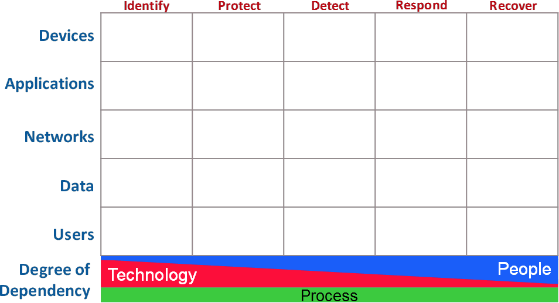

---

layout: col-sidebar
title: OWASP Cyber Defense Matrix
tags: cyberdefensematrix
level: 2
type: documentation

---

# Introduction

Imagine going into a grocery store to shop for Thanksgiving dinner, but instead of seeing nice, orderly aisles, you see a massive pile of food in the middle of the grocery store. Finding the ingredients that you need to make dinner is going to be extremely hard because there’s no organizational system helping you understand where things are. The disorganization makes it very difficult to find what you need and compare competing products.

The cybersecurity vendor marketplace is like this disorganized grocery store. A proof of this assertion can be seen by looking at the vendor hall at any major security conference. The cacophony of sounds from vendors hawking their wares, the confusing language of the vendor’s marketecture, and the lack of any semblance of organization (aside from biggest to smallest) does not help buyers understand what they need or where to find it.

Because the cybersecurity community does not use consistent terminology to describe what we need, there is much confusion about what many vendor products actually do. Instead of a clear articulation of a product's capabilities, we are bombarded with overused, trendy jargon that usually leaves us wondering if the product can really solve any of our problems. Some security teams even organize themselves according to the jargon. We need to stop letting marketing pitches dictate our terminology and not lose sight of the more bland descriptors that actually tell us what something does.

The Cyber Defense Matrix helps us understand what we need organized through a logical construct so that when we go into the security vendor marketplace, we can quickly discern what products solve what problems and be informed on what is the core function of a given product. In addition, the Cyber Defense Matrix provides a mechanism to ensure that we have capabilities across the entire spectrum of options to help secure our environments.

Although the Cyber Defense Matrix was initially created to help organize security technologies, many other use cases have been discovered to help build, manage, and operate a security program. This project intends to capture these use cases and their implementations to help security practitioners mature their security programs.

# Structure of the Cyber Defense Matrix

The basic construct of the Cyber Defense Matrix starts with two dimensions. The first dimension captures the five operational functions of the NIST Cybersecurity Framework:

<table><th>IDENTIFY</th><th>PROTECT</th><th>DETECT</th><th>RESPOND</th><th>RECOVER</th></table>

The second dimension captures five assets classes that we try to secure:

|DEVICES|
|:---:|
|**APPLICATIONS**|
|**NETWORKS**|
|**DATA**|
|**USERS**|

When these two dimensions are put into a grid, we arrive at a five-by-five matrix that we call the “Cyber Defense Matrix.”

There is one more important piece of this matrix. At bottom of the grid, we show a continuum that characterizes the degree of dependency on technology, people, and process as we progress through the five operational functions of the NIST Cybersecurity Framework.  TECHNOLOGY plays a much greater role in IDENTIFY and PROTECT. As we move to DETECT, RESPOND, and RECOVER, our dependency on TECHNOLOGY diminishes and our dependency on PEOPLE grows. Throughout all five operational functions, there's a consistent level of dependency on PROCESS. This continuum helps us understand where we might have imbalances in our reliance on PEOPLE, PROCESS, and TECHNOLOGY when trying to tackle our cybersecurity challenges.

We believe that this matrix is a realistic model describes a broad range of cybersecurity practices. In this website, you will find several insights on the Cyber Defense Matrix and examples of how to leverage it to address the challenges that we face in cybersecurity.

If you discover a new use of the Cyber Defense Matrix, we would love to hear about it. Likewise, if you find a problem with the matrix in that it doesn't seem to properly describe something that we do in cybersecurity, please point that out, and we'll either adjust the matrix or clarify how that perceived discrepancy can be addressed or explained through the matrix.

# How can I participate in this project?

Everyone is invited to collaborate on this project. Contact the [Project Leaders](leaders.md "Project Leaders"). The project needs different skills and expertise and different times during its development. Currently, we are looking for help in the following areas:

- Documenting new use cases
- Developing a website / system to capture everything that is mapped to the Cyber Defense Matrix. This includes:
	- Mapping of vendors
	- Mapping of NIST NICE NCWF skillsets
	- Mapping of measurements and metrics
	- Security design patterns
	
